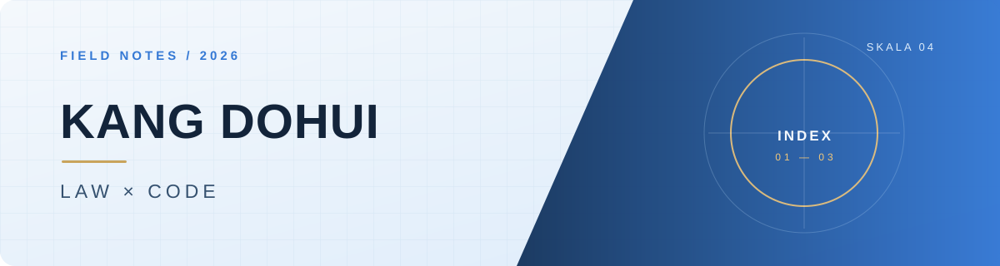

<picture>
  <source media="(prefers-color-scheme: dark)" srcset="./profile-assets/header-dark.svg">
  <source media="(prefers-color-scheme: light)" srcset="./profile-assets/header-light.svg">
  
</picture>

  <strong>법학의 질문을, 작동하는 기술로.</strong> 
  AI 학습 도구 · 데이터 분석 · macOS 앱 &nbsp; / &nbsp; SKALA 4기

  <a href="https://github.com/Kangdohui/ai-campus">AI CAMPUS</a> &nbsp;·&nbsp;
  <a href="https://github.com/Kangdohui/career-control">CAREER CONTROL</a> &nbsp;·&nbsp;
  <a href="https://github.com/Kangdohui/ess-health-cycle-life">ESS CYCLE LIFE</a> &nbsp;·&nbsp;
  <a href="https://blog.naver.com/dori-__-">BLOG</a>

 

## SELECTED WORK

### 01 &nbsp; AI, made teachable

**[AI CAMPUS ↗](https://github.com/Kangdohui/ai-campus)** 
과목과 수준에 맞춰 한국어 AI 튜터가 설명하고, 학습 기록으로 성장 흐름을 이어가는 도구입니다.

PYTHON &nbsp; · &nbsp; STREAMLIT &nbsp; · &nbsp; KOREAN AI

### 02 &nbsp; A small command center for the day

**[Career Control ↗](https://github.com/Kangdohui/career-control)** 
일정·메모·시스템 상태를 한 화면에 모은 macOS 메뉴 막대 앱입니다. CPU 사용량에 반응하는 러너도 만들었습니다.

SWIFT &nbsp; · &nbsp; MACOS &nbsp; · &nbsp; GOOGLE SHEETS

### 03 &nbsp; Reading the battery before it fades

**[ESS Health Cycle Life ↗](https://github.com/Kangdohui/ess-health-cycle-life)** 
초기 충·방전 구간의 신호를 살펴 배터리 수명과 어떤 관계가 있는지 분석했습니다.

PYTHON &nbsp; · &nbsp; EDA &nbsp; · &nbsp; REGRESSION

 

## HOW I BUILD

  <strong>QUESTION</strong> &nbsp; ⟶ &nbsp; <strong>MODEL</strong> &nbsp; ⟶ &nbsp; <strong>PROTOTYPE</strong> &nbsp; ⟶ &nbsp; <strong>LEARN</strong> 
  복잡한 문제를 작게 나누고, 직접 써 볼 수 있는 형태까지 만듭니다.

 

  
  

좋은 질문을 더 쓸모 있는 도구로 바꾸는 중.

