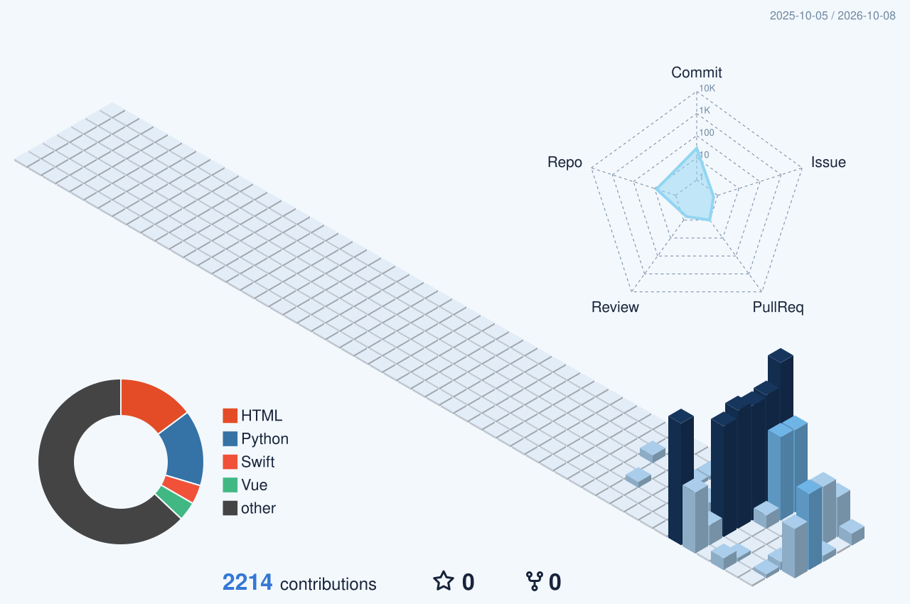

## KANG DOHUI · LAW × PRODUCT

법학에서 익힌 논점 정리와 근거 중심의 사고를 AI 학습 도구와 macOS 소프트웨어로 구현합니다.

<a href="https://dohui-decision-studio.kdh-reachhope.chatgpt.site"><strong>OPEN INTERACTIVE CASEBOOK ↗</strong></a> &nbsp;·&nbsp; <a href="https://blog.naver.com/dori-__-">FIELD NOTES</a>

## SELECTED WORK

| PROJECT | WHAT IT DOES | STACK |
|:--|:--|:--|
| [AI CAMPUS](https://github.com/Kangdohui/ai-campus) | 과목 맥락에 맞춘 설명과 학습 기록을 잇는 한국어 AI 튜터 | Python |
| [CAREER CONTROL](https://github.com/Kangdohui/career-control) | 일정과 시스템 상태를 모아 보는 macOS 메뉴 막대 앱 | Swift |
| [ESS CYCLE LIFE](https://github.com/Kangdohui/ess-health-cycle-life) | 초기 충·방전 데이터로 배터리 수명을 살펴본 분석 | Python |

## CONTRIBUTION TRACE

  

## PERSONAL SIGNAL

MBTI와 사주를 제가 선택한 아이덴티티 표식으로 두었습니다.

  

